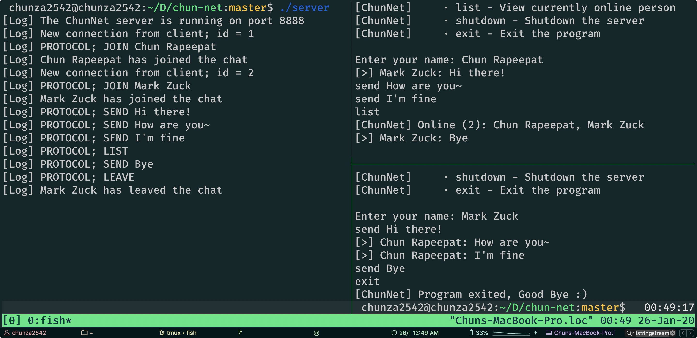

# chun-net
ChunNet - A chat application is written in C++ using socket programming



## Setup
1. Clone this repository and cd into it
```bash
$ git clone https://github.com/chunza2542/chun-net

$ cd chun-net && make help
ChunNet: A chat application is written in C++ using socket programming

* server: Build the server
* client: Build the client
* all:    Build the server and client
* clean:  Remove project binaries
```

2. Build project binaries
```bash
$ make all
* Building Server
* Building Client
* Done
```

## Hosting the Chat-Server
```bash
$ ./server
[Log] The ChunNet server is running on port 8888
```

## Connecting to the Chat-Server via Client
```bash
$ ./client
[ChunNet] Connection has been established!
```

## Cleaning binaries
```bash
$ make clean
* Done
```

## Protocol Design
1. Request
```bash
Format: <type> [payload]
Type: JOIN <username>, LEAVE, SEND <message>, LIST, SHUTDOWN
```

2. Response
```bash
Format: <type> <status> [payload]
Type: JOIN, LEAVE, LIST, SHUTDOWN, SEND, CHAT
Status: ERR, OK
```

<hr>
Made with ❤️ by Chun Rapeepat
